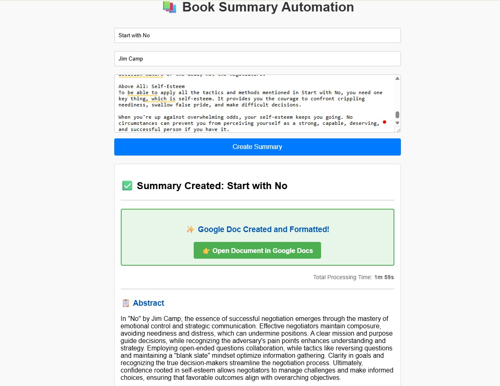

# 📚 AI Book Summary Agent

An AI-powered Book Summary Agent built with Flask and OpenAI that transforms long book content into clean, structured summaries and automatically generates beautifully formatted Google Docs.

---

## 🚀 Features

- Section-wise AI-generated book summaries/n
- Super summary, abstract, and key points generation  
- AI-generated story with emotion and humor  
- Strict prompt engineering for human-like output  
- Automatic Google Docs creation and formatting  
- Flask-based web interface  

---

## 🛠 Tech Stack

- Python  
- Flask  
- OpenAI API  
- Prompt Engineering  
- Google Docs API  

---

## 📸 Screenshot

Below is an example of the generated summary output:




---

## 🎥 Demo Video

Watch a short demo of the system in action:
https://github.com/user-attachments/assets/7586d56d-91ec-43d8-b7a4-2d7771b941ab

▶️ [Watch Demo Video](Media/demo.mp4)

---

Book: Start with No by Jim Camp

Super Summary:

Negotiation requires a blend of strategy, emotional intelligence, and self-awareness. Recognizing the importance of clarity, control, and understanding in interactions can transform outcomes. A well-prepared negotiator remains focused on objectives, collaboration, and achieving success through thoughtful engagement and a calm demeanor.

Abstract:

In Start with No by Jim Camp, the essence of successful negotiation emerges through the mastery of emotional control and strategic communication. Effective negotiators maintain composure, avoiding neediness and distress, which can undermine positions. A clear mission and purpose guide decisions, while recognizing the adversary's pain points enhances understanding and strategy. Employing open-ended questions and collaboration, while tactics like reversing questions and maintaining a "blank slate" mindset optimize information gathering. Confidence rooted in self-esteem allows negotiators to manage challenges and make informed choices, ensuring favorable outcomes.

Key Points:

Avoid showing distress to strengthen your negotiation position.

Use open-ended questions to foster meaningful dialogue.

Maintain a clear mission to guide your negotiation efforts.

Understand both your and your opponent's pain points for better outcomes.

Keep your agenda focused on key negotiation issues and goals.

Show vulnerability to create a comfortable negotiation atmosphere.

Strong self-esteem helps you stay composed and confident in negotiations.

🔗 **Full formatted summary (Google Docs):**  
[https://docs.google.com/document/d/YOUR_DOCUMENT_ID](https://docs.google.com/document/d/1dLIgo69-sF3K2DPsm3tPx4yqDaOVeJBxX_B7h3dLFdg/edit?tab=t.0)


---

## ⚙️ Setup Instructions

1. Clone the repository:
```bash
git clone https://github.com/YOUR_USERNAME/Book_summary_agent.git
